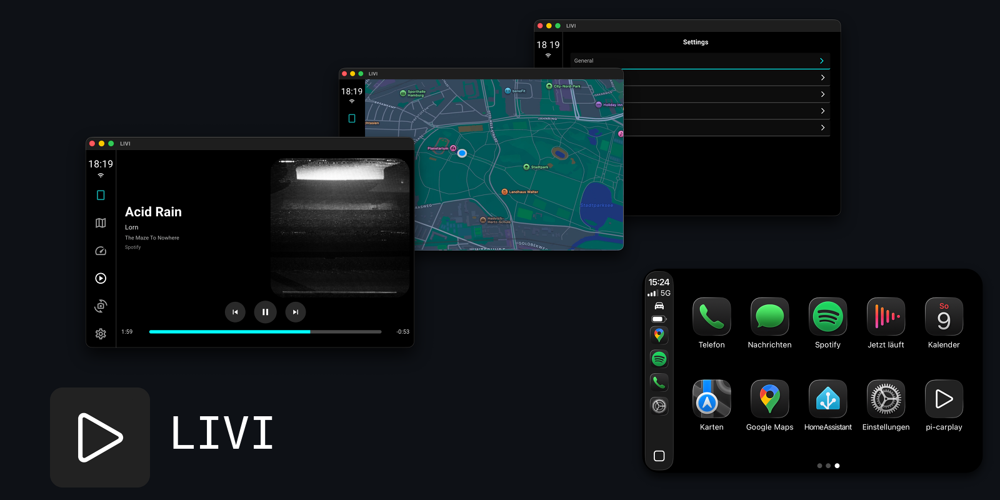
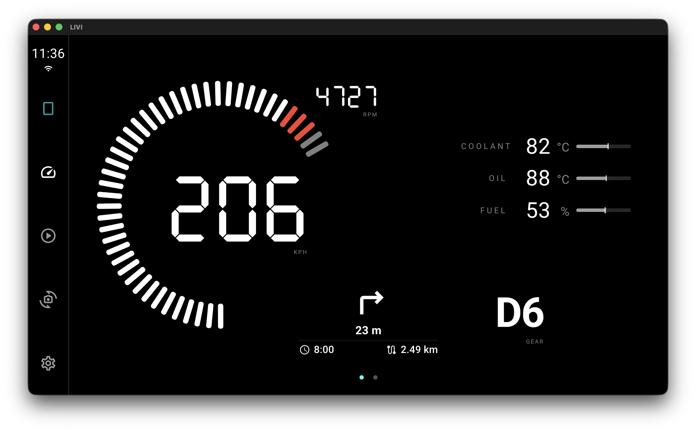
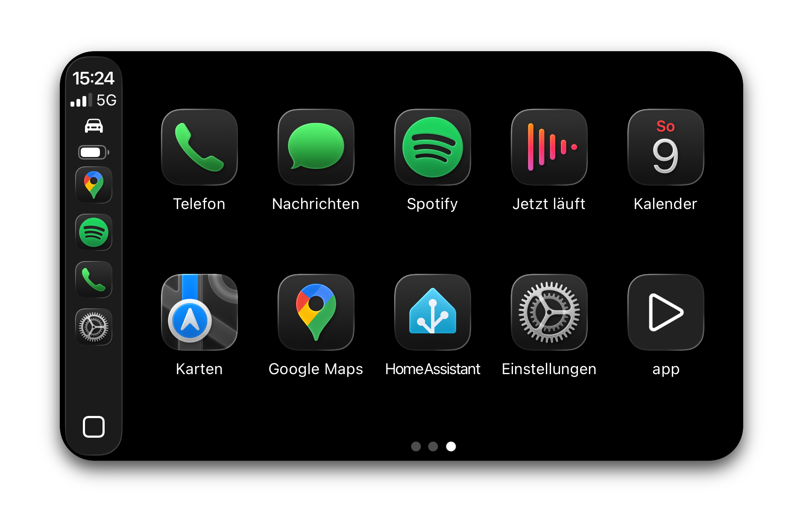
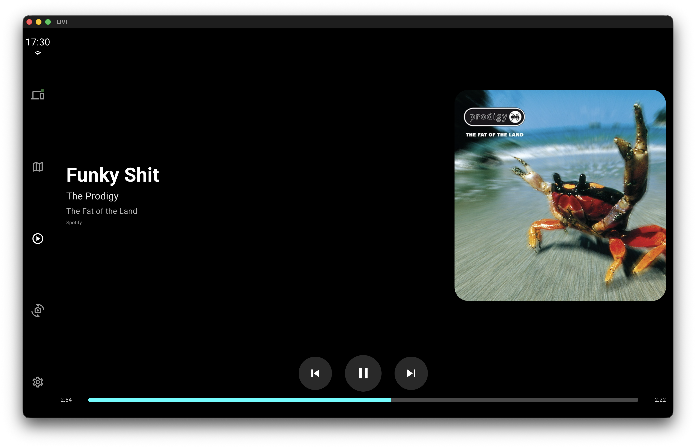
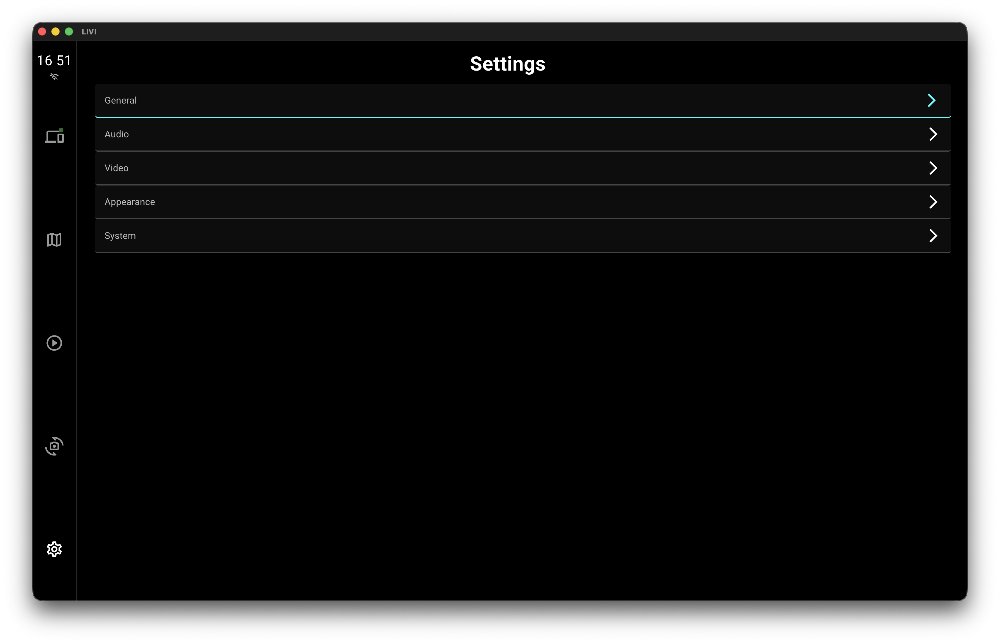
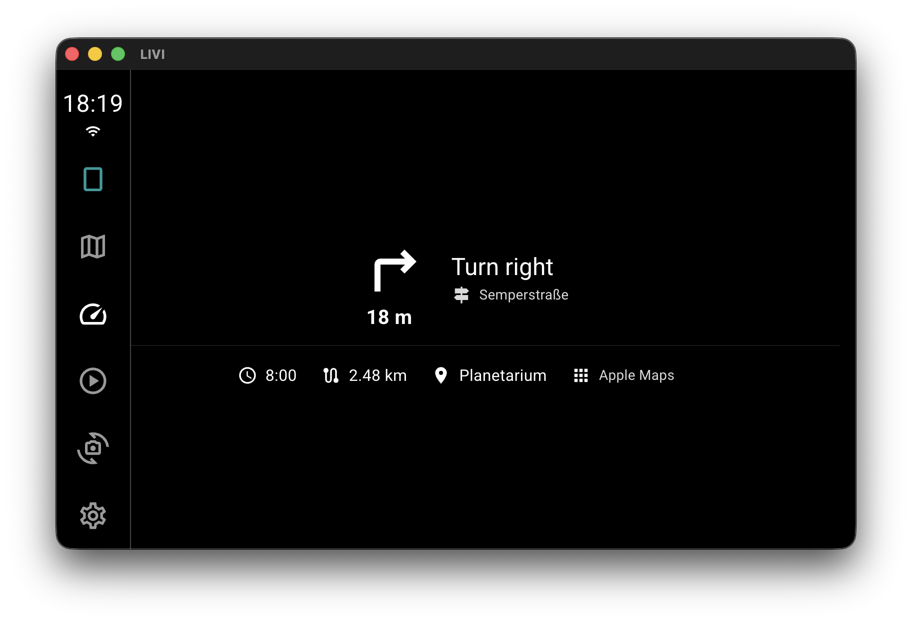

<p align="center">
  
</p>

# LIVI – Linux In-Vehicle Infotainment

LIVI is an open-source **Apple CarPlay and Android Auto head unit for Linux**.

It is a standalone cross-platform Electron head unit with hardware-accelerated video decoding, low-latency audio, multitouch + D-Pad navigation, and support for very small embedded/OEM displays.

> **Supported USB adapters:** Carlinkit **CPC200-CCPA** (wireless/wired) and **CPC200-CCPW** (wired)

## Project Status


## Installation

> [!IMPORTANT]
> LIVI requires **WebGL2 or WebGPU support**.

### Raspberry Pi OS

```bash
curl -fL -o install.sh https://raw.githubusercontent.com/f-io/LIVI/main/scripts/install/pi/install.sh
chmod +x install.sh
./install.sh
```

> Raspberry Pi OS **Trixie or newer** is required for WebGL2 support.

The `install.sh` script performs the following tasks:

1. checks for required tools: curl and xdg-user-dir
2. configures udev rules to ensure proper access rights for the CarPlay dongle
3. downloads the latest LIVI AppImage
4. creates an autostart entry so the application launches automatically on boot
5. creates a desktop shortcut for easy access

_This install script is not actively tested on other Linux distributions._

### Linux (x86_64)

This AppImage has been tested on **Debian Trixie (13)** with Wayland. No additional software is required — just download the `-x86_64.AppImage` and make it executable. Depending on your distro and how you run the app, you may need a udev rule to access the USB dongle. It presents as a composite (multi-class) USB device, and unlike single-class devices, its interfaces often require explicit permissions.

```bash
sudo bash -c '
  RULE_FILE="/etc/udev/rules.d/99-LIVI.rules"
  USER_NAME="${SUDO_USER:-$USER}"

  echo "Creating udev rule for Carlinkit dongle (owner: $USER_NAME)"
  echo "SUBSYSTEM==\"usb\", ATTR{idVendor}==\"1314\", ATTR{idProduct}==\"152*\", " \
       "MODE=\"0660\", OWNER=\"$USER_NAME\"" \
    > "$RULE_FILE"

  echo "Reloading udev rules…"
  udevadm control --reload-rules
  udevadm trigger

  echo "Done."
'
```

```bash
chmod +x LIVI-*-x86_64.AppImage
```

### Mac (arm64)

Just download the `-arm64.dmg`, open it, and drag LIVI.app into Applications. Then remove the Gatekeeper quarantine once and launch the app.
This step is required for all non-Apple-signed apps and future in-app updates will preserve this state.

```bash
xattr -cr /Applications/LIVI.app
```

For audio support, please install Sound eXchange (SoX) via brew.

```bash
brew install sox
```

## Build Environment


### System Requirements (build)

Make sure the following packages and tools are installed on your system before building:

- **Python 3.x** (for native module builds via `node-gyp`)
- **build-essential** (Linux: includes `gcc`, `g++`, `make`, etc.)
- **libusb-1.0-0-dev** (required for `node-usb`)
- **libudev-dev** (optional but recommended for USB detection on Linux)
- **fuse** (required to run AppImages)

### Clone & Build

```bash
git clone --branch main --single-branch https://github.com/f-io/LIVI.git \
  && cd LIVI \
  && corepack enable \
  && corepack install

# Install dependencies from lockfile
pnpm run install:ci

# --- Build targets ---

# Linux x86_64 (AppImage)
pnpm run build:linux

# Linux ARM64 (AppImage)
pnpm run build:armLinux

# macOS (arm64 dmg)
pnpm run build:mac
```

## Dashboard

The Dashboard is currently in an early stage. While the IPC/socket telemetry payload already supports many signals, the UI exposes only a small subset. Widgets and layouts will be extended over time.

### Telemetry Simulator (local)

To feed demo telemetry into the app, you can run the simulator from `scripts/tools`:

```bash
pnpm --dir scripts/tools install
pnpm --dir scripts/tools tsx telemetry-sim.ts cycle
```

<p align="center">
  
</p>

## Dongle Firmware Feature Matrix

The available features depend on the firmware version running on the Carlinkit dongle.
Listed limitations are firmware-level restrictions and cannot be fixed by the application.

| Firmware Version | Nav Auto Switch | Call Auto Switch | Audio Metadata | Web Interface | Notes                                    |
| :--------------: | :-------------: | :--------------: | :------------: | :-----------: | :--------------------------------------- |
| 2025.10.15.1127  |       🟢        |        🟢        |       🟢       |      🟢       | Full feature set                         |
| 2025.02.25.1521  |       🔴        |        🟢        |       🟢       |      🟢       | No auto switching on navigation guidance |
| 2021.02.23.1758  |       🔴        |        🟡        |       🔴       |      🔴       | Limited protocol support                 |

`🟢` = Supported, `🔴` = Not supported, `🟡` = Unknown

## Images

<p align="center">
  
</p>

<p align="center">
  
  &emsp;
  
</p>

<p align="center">
  
  &emsp;
  
</p>

## Credits

See [CREDITS](CREDITS.md) for acknowledgements and prior art.

## Disclaimer

_Apple and CarPlay are trademarks of Apple Inc. Android and Android Auto are trademarks of Google LLC. This project is not affiliated with or endorsed by Apple or Google. All product names, logos, and brands are the property of their respective owners._

## License

This project is licensed under the MIT License.
