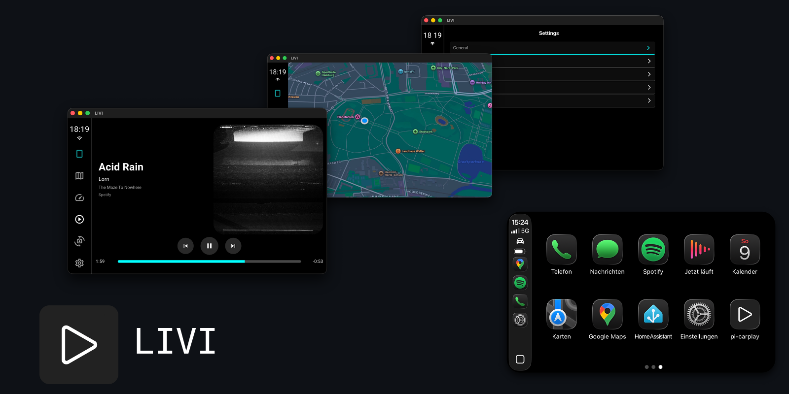
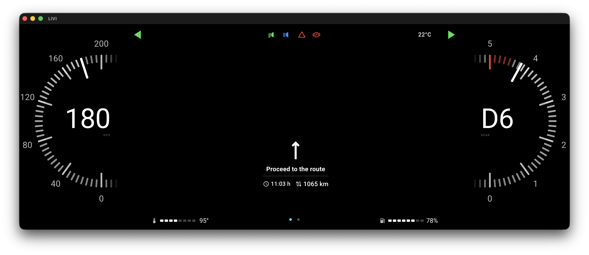
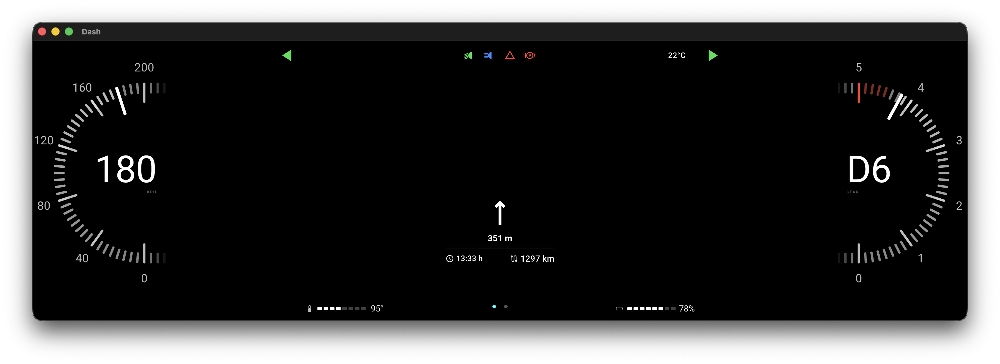
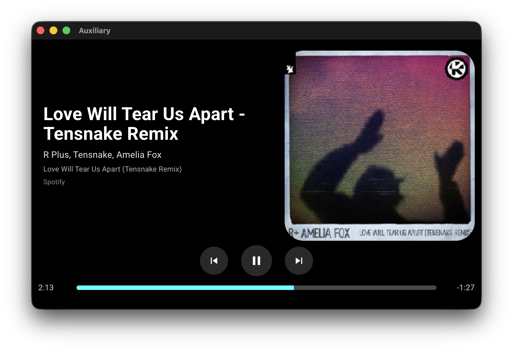
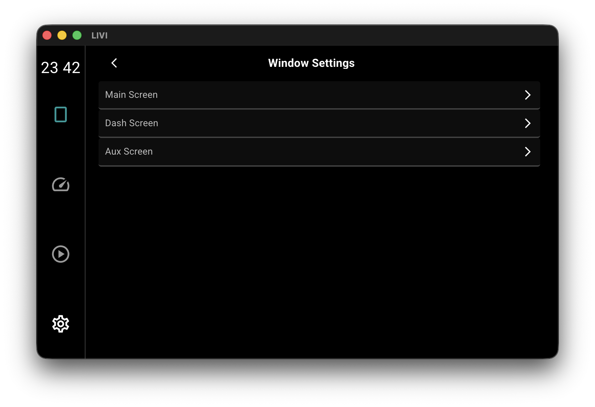
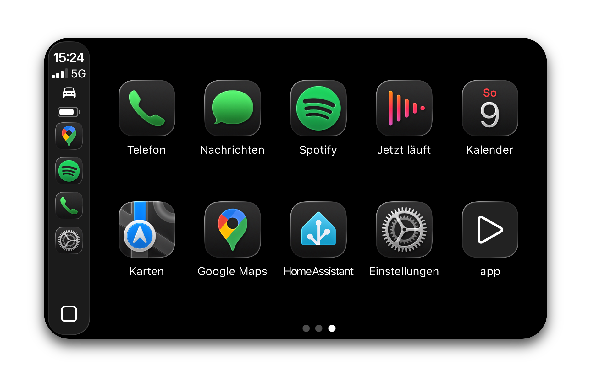
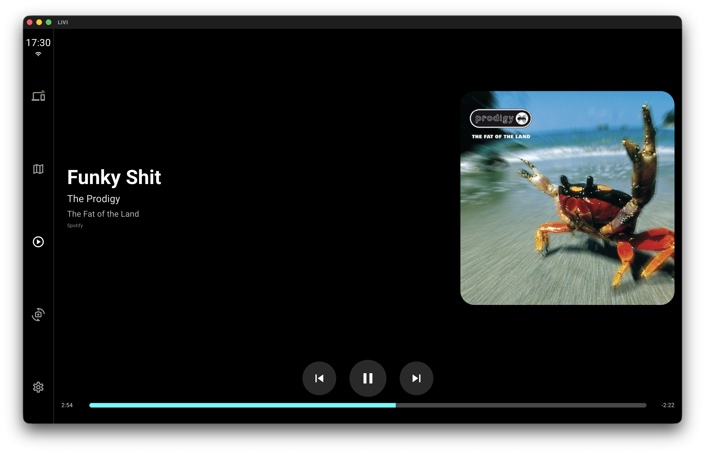
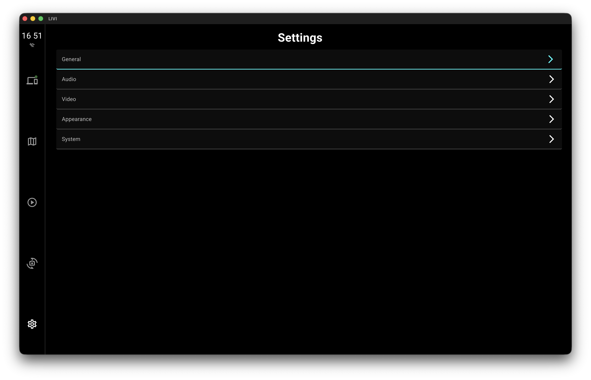

<p align="center">
  
</p>

# LIVI – Linux In-Vehicle Infotainment

LIVI is an open-source **Apple CarPlay and Android Auto head unit**.

It is a standalone cross-platform Electron head unit with a native, zero-copy GStreamer video pipeline and hardware-accelerated decoding on Linux (including the Raspberry Pi 4 and 5), macOS and Windows, low-latency audio, multitouch + D-Pad navigation, and support for very small embedded/OEM displays.

## Native Connectivity

- **Apple CarPlay** (wired & wireless) on Linux — requires [MFi Authentication](#mfi-authentication)
- **Android Auto** (wired) on all platforms
- **Android Auto** (wireless) on Linux

## Native Apple CarPlay

LIVI implements the CarPlay accessory side natively on Linux. Wireless sessions run over LIVI's own Wi-Fi access point with Bluetooth pairing, wired sessions run directly over the USB cable (no OTG required).

- main + instrument cluster video (H.264/H.265, hardware decoded, zero-copy)
- audio playback, phone calls, microphone uplink
- now-playing metadata incl. album art, turn-by-turn navigation data
- touch, knob/D-Pad and hard-key input
- day/night mode and GPS forwarding to the phone
- multi-session with live switching between connected phones

Wireless CarPlay requires a Bluetooth adapter and a Wi-Fi interface dedicated to the access point. Wired CarPlay works on any USB port.

## MFi Authentication

CarPlay requires the accessory to authenticate against the phone using an Apple **MFi authentication coprocessor**. This is a hardware chip, it cannot be emulated in software, and LIVI does not ship or bypass it. You need a physical coprocessor (e.g. salvaged from a certified CarPlay accessory or sourced as a module) wired to the I²C bus of your board.

LIVI talks to the chip directly. Configuration (`config.json`):

| Key                   | Default | Description                          |
| --------------------- | ------- | ------------------------------------ |
| `carPlayMfiI2cBus`    | `2`     | I²C bus number the coprocessor is on |
| `carPlayMfiPowerGpio` | `21`    | GPIO that powers the coprocessor     |

Without a coprocessor, native CarPlay is unavailable. Dongle-based CarPlay and all Android Auto paths work regardless.

### Example Rasperry Pi config
```bash
# CP3.0, CP2.0C, CP2.0B
dtoverlay=i2c-gpio,bus=2,i2c_gpio_sda=19,i2c_gpio_scl=26,i2c_gpio_delay_us=5
```

## Dongle-based Connectivity

- **Android Auto** (wired & wireless) on all platforms
- **Apple CarPlay** (wired & wireless) on all platforms

> **Supported USB adapters:** **CPC200-CCPA** (wireless/wired) and **CPC200-CCPW** (wired)

## Project Status


## Installation

> [!IMPORTANT]
> LIVI requires **OpenGL ES 3.x**.

## Desktop session

For a host that already runs a desktop session. Written for Raspberry Pi OS, and it should work the same on Debian or any other apt-based Linux with a desktop.

> [!NOTE]
> The Pi 4, CM 4, Pi 5 and CM 5 require Trixie (Debian 13) for OpenGL ES 3.x. Pi 3 and earlier use the VideoCore IV GPU, which only supports OpenGL ES 2.0 and is therefore unsupported.

```bash
curl -fL -o install.sh https://raw.githubusercontent.com/f-io/LIVI/main/scripts/install/desktop/install.sh
chmod +x install.sh
./install.sh
```

_This install script is not actively tested on other Linux distributions._

## Headless

For a host with no desktop session. Written for Raspberry Pi OS Lite, and it should work the same on Debian or any other apt-based headless Linux, on arm64 and x86_64 alike.

```bash
curl -fL -o install.sh https://raw.githubusercontent.com/f-io/LIVI/main/scripts/install/headless/install.sh
chmod +x install.sh
./install.sh
```

Reboot when it finishes. LIVI then runs fullscreen on tty1 and logs to `~/LIVI/LIVI.log`. Shutting LIVI down from its own menu ends the service and hands tty1 back to the login shell, so a reboot brings the kiosk back.


> [!NOTE]
> The script sets the boot target to `multi-user.target` so the kiosk owns the screen. On a host that boots into a desktop, that disables the graphical login. Undo it with `sudo systemctl set-default graphical.target`.

## Linux (x86_64)

This AppImage has been tested on Debian Trixie (13) with Wayland, Fedora 44 (GNOME) and Ubuntu 26.04.

```bash
chmod +x LIVI-*-x86_64.AppImage
```

> **Hardware video decode (optional):** LIVI uses the system VA-API driver for GPU video decode (it is not bundled, since it must match your GPU and kernel). Most desktops ship it, a minimal install may not. Without it LIVI still works via software decode. For HW decode install the driver for your GPU and verify with `vainfo`: `i965-va-driver` (older Intel, e.g. Broadwell), `intel-media-va-driver` (Gen9+ Intel), `mesa-va-drivers` (AMD).

## Mac (arm64)

Download the `-arm64.dmg`, open it, and drag **LIVI.app** into Applications.

When launching the app for the first time, macOS may block it.
In that case:

1. Try to open the app once (it will be blocked)
2. Go to **System Settings → Privacy & Security**
3. Scroll down and click **“Open Anyway”**
4. Confirm the dialog

After this, the app will launch normally and future updates will work without additional steps.

## Windows (x64)

> [!NOTE]
> The Windows build is provided on a **best-effort basis**. Windows is **not a primary target platform** of this project and receives limited testing.
> It is mainly intended for development, experimentation, and desktop testing.

### USB Driver Requirement

The dongle requires a compatible **WinUSB (winusb.sys)** driver on Windows.
You can install it using a tool such as **Zadig** (libwdi): https://github.com/pbatard/libwdi/releases

Steps:

1. Plug in the dongle
2. Start Zadig
3. Select the dongle from the device list
4. Install the **WinUSB (winusb.sys)** driver

## Build Environment


### System Requirements (build)

Make sure the following packages and tools are installed on your system before building. The lists below cover both building and running, including everything native CarPlay needs:

- **Node.js 24.x** (with `corepack` for `pnpm`)
- **Python 3.x** (for native module builds via `node-gyp`)
- **build-essential** (Linux: includes `gcc`, `g++`, `make`, etc.)
- **libgstreamer1.0-dev** + **libgstreamer-plugins-base1.0-dev** (required to build the `gst-video` addon)
- **meson** (≥ 1.4), **ninja**, **pkg-config**, **bison**, **cmake** and the wlroots/EGL stack: **libwayland-dev**, **wayland-protocols**, **libxkbcommon-dev** (≥ 1.8.0), **libpixman-1-dev**, **libcairo2-dev**, **libegl-dev** / **libgles-dev** / **libgbm-dev** / **libffi-dev** / **libexpat1-dev** (Linux only: to build the embedded wlroots compositor)
- **fuse3** (required to run AppImages)
- runtime packages for native CarPlay and wireless Android Auto: **bluez**, **libspa-0.2-bluetooth**, **hostapd**, **dnsmasq-base**, **iw**, **rfkill**, **avahi-daemon**, **avahi-utils**, **pulseaudio-utils**, **python3-dbus**, **python3-gi**, **python3-smbus2**, and **pymobiledevice3** from pip for wired CarPlay

On Debian/Ubuntu/Raspberry Pi OS, install everything with:

```bash
sudo apt-get update
sudo apt-get install -y git build-essential python3 python3-dev python3-pip \
  pkg-config bison ninja-build cmake \
  libgstreamer1.0-dev libgstreamer-plugins-base1.0-dev \
  libegl-dev libgles-dev libgbm-dev libffi-dev libexpat1-dev \
  libwayland-dev wayland-protocols libxkbcommon-dev libpixman-1-dev libcairo2-dev \
  fuse3 bluez libspa-0.2-bluetooth hostapd dnsmasq-base iw rfkill avahi-daemon avahi-utils \
  pulseaudio-utils python3-dbus python3-gi python3-smbus2
pip3 install --user --break-system-packages 'meson>=1.4' pymobiledevice3
curl -fsSL https://deb.nodesource.com/setup_24.x | sudo -E bash -
sudo apt-get install -y nodejs
sudo corepack enable
```

On a Raspberry Pi, the MFi coprocessor is powered from a GPIO, which needs one more package:

```bash
sudo apt-get install -y python3-lgpio python3-rpi-lgpio
```

Raspberry Pi OS ships both already, a plain Debian on a Pi does not.

On Fedora, install everything with:

```bash
sudo dnf install -y git gcc gcc-c++ make python3 python3-devel \
  pkgconf-pkg-config systemd-devel \
  gstreamer1-devel gstreamer1-plugins-base-devel \
  meson ninja-build bison cmake \
  wlroots-devel wayland-devel wayland-protocols-devel libxkbcommon-devel \
  pixman-devel cairo-devel \
  mesa-libEGL-devel mesa-libGLES-devel mesa-libgbm-devel libffi-devel expat-devel \
  fuse3 fuse3-libs \
  bluez hostapd dnsmasq iw avahi avahi-tools pulseaudio-utils \
  python3-dbus python3-gobject
pip3 install --user pymobiledevice3 smbus2
curl -fsSL https://rpm.nodesource.com/setup_24.x | sudo bash -
sudo dnf install -y nodejs
sudo corepack enable
```


Fedora has no `rfkill` package, the command comes with `util-linux`, and `python3-smbus2` does not exist there either, so `smbus2` comes from pip above. `libspa-0.2-bluetooth` is a Debian name too: it holds PipeWire's Bluetooth plugin, which Fedora ships inside `pipewire-libs`. Wireless Android Auto needs that plugin because the phone will only start a session over an HFP connection, and PipeWire is what puts HFP into the adapter's service record. LIVI's package check probes for the plugin's directory rather than a package name, so it reports the gap on any distro. Everything else, including wireless CarPlay, works the same.

On macOS, the `gst-video` addon links against the **GStreamer.framework**. Install
both the runtime and development packages (matching versions) from
[gstreamer.freedesktop.org](https://gstreamer.freedesktop.org/download/#macos)
before building. `node-gyp` discovers it via `pkg-config` under
`/Library/Frameworks/GStreamer.framework`.

### Clone & Build

```bash
# Git clone
git clone --branch main --single-branch https://github.com/f-io/LIVI.git \
  && cd LIVI

# Install dependencies from lockfile
pnpm run install:ci

# --- Build targets ---

# Linux (AppImage)
pnpm run build:linux:arm64         # ARM
pnpm run build:linux:x64           # X86_64

# macOS (dmg)
pnpm run build:mac:arm64           # Apple Silicon
pnpm run build:mac:x64             # Intel
```

## Dashboard

The Dashboard is currently in an early stage. While the IPC/socket telemetry payload already supports many signals, the UI exposes only a small subset. Widgets and layouts will be extended over time.

### Telemetry CLI (local)

To push test data into a running LIVI, use the CLI in `scripts/tools`. The full
field list and routing (Dash / AA / Dongle) lives in
`src/main/shared/types/Telemetry.ts`.

```bash
pnpm -C scripts/tools install

# Realistic all-fields demo push
pnpm -C scripts/tools run telemetry:demo

# Send single fields or blocks ad-hoc
pnpm -C scripts/tools run telemetry:set fuelPct=4 rangeKm=38
pnpm -C scripts/tools run telemetry:set gps.lat=53.5912 gps.lng=10.015
pnpm -C scripts/tools run telemetry:set _repeatMs=1000 speedKph=90 rpm=2500
```

<p align="center">
  
</p>

## View and Safe Area

Stream resolution, view area insets, and safe area can be configured independently for the main and cluster streams. This is supported for Android Auto as well as CarPlay.

### Main Stream
Video: 1280x720 - View Area: 0/0/100/0 (T/B/L/R) - Safe Area: 100/100/100/100 (T/B/L/R) - Draw Outside: true
<p align="center">
  
</p>

### Cluster Stream
Video: 1280x720 - View Area: 0/0/0/0 (T/B/L/R) - Safe Area: 60/20/350/350 (T/B/L/R)
<p align="center">
  
</p>

## Multi-Display

LIVI can run as multiple windows at once, each placeable on its own physical display.
The Dash and Aux windows are freely assignable and can show the Dashes, the reverse camera or the media player. Assignment is not exclusive: any feature can be shown on one, several, or all windows at the same time.

Configure each window under Settings → Window Settings
(Main Screen / Dash Screen / Aux Screen), and assign features under
Settings → General → Tab Settings.

<p align="center">
  
</p>

<p align="center">
  
  
</p>

## Images

<p align="center">
  
  &emsp;
  
</p>

<p align="center">
  
  &emsp;
  
</p>

## Debugging

Diagnostic environment flags and where to find the logs are documented in [DEBUGGING.md](DEBUGGING.md).

## Credits

See [CREDITS](CREDITS.md) for acknowledgements and prior art.

## Disclaimer

_Apple and CarPlay are trademarks of Apple Inc. Android and Android Auto are trademarks of Google LLC. This project is not affiliated with or endorsed by Apple or Google. All product names, logos, and brands are the property of their respective owners._

## License

LIVI is free software, licensed under the **GNU General Public License v3.0 or later** (`GPL-3.0-or-later`). See [LICENSE](LICENSE) for the full text.

Copyright (C) 2025 Lasse Heitgres

You are free to use, study, share, and modify LIVI. If you distribute it or a modified version, you must pass on the same freedoms and make the corresponding source available under the GPL. It comes with NO WARRANTY, to the extent permitted by law.
