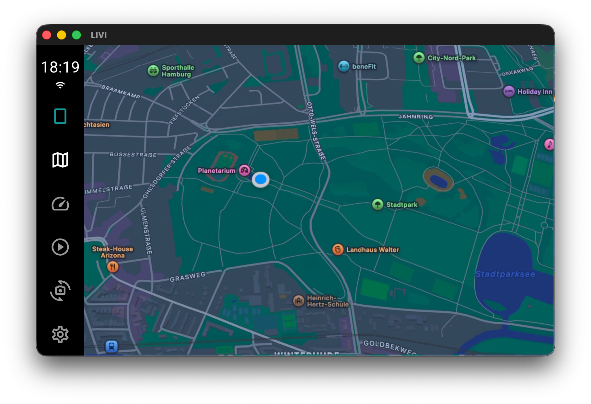
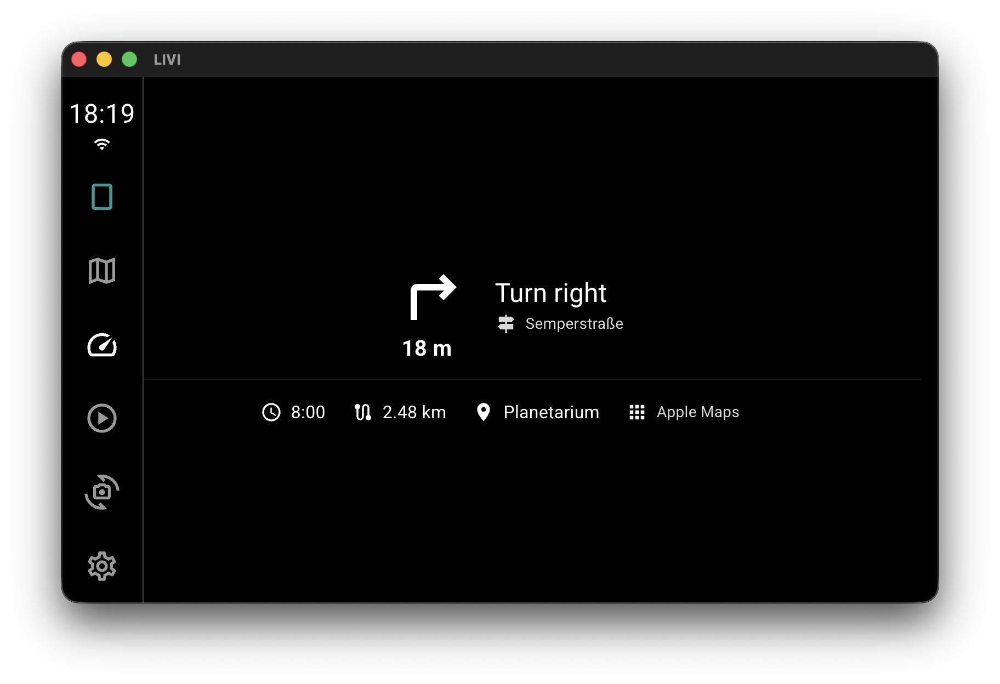

<p align="center">
  
</p>

# LIVI – Linux In-Vehicle Infotainment

LIVI is an open-source **Apple CarPlay and Android Auto head unit**.

It is a standalone cross-platform Electron head unit with hardware-accelerated video decoding, low-latency audio, multitouch + D-Pad navigation, and support for very small embedded/OEM displays.

## Native Connectivity

- **Android Auto** (wired) on all platforms
- **Android Auto** (wireless) on Linux

## Dongle-based Connectivity

- **Android Auto** (wired & wireless) on all platforms
- **Apple CarPlay** (wired & wireless) on all platforms

> **Supported USB adapters (for CarPlay):** Carlinkit **CPC200-CCPA** (wireless/wired) and **CPC200-CCPW** (wired)

## Project Status


## Installation

> [!IMPORTANT]
> LIVI requires **WebGL2 or WebGPU support**.

## Raspberry Pi OS

```bash
curl -fL -o install.sh https://raw.githubusercontent.com/f-io/LIVI/main/scripts/install/pi/install.sh
chmod +x install.sh
./install.sh
```

> Raspberry Pi OS **Trixie or newer** is required for WebGL2 support.

The `install.sh` script performs the following tasks:

1. checks for required tools: curl, xdg-user-dir and pkexec
2. downloads the latest LIVI AppImage
3. creates an autostart entry so the application launches automatically on boot
4. creates a desktop shortcut for easy access

On first launch, LIVI will detect if the udev rule for USB access is missing and prompt you to install it automatically.

_This install script is not actively tested on other Linux distributions._

## Linux (x86_64)

This AppImage has been tested on Debian Trixie (13) with Wayland, Ubuntu/Kubuntu 25 and Fedora 44. No additional software is required, just download the `-x86_64.AppImage` and make it executable:

```bash
chmod +x LIVI-*-x86_64.AppImage
```

On first launch, LIVI will detect if the udev rule for the USB dongle is missing and prompt you to install it automatically.

> **Ubuntu / Kubuntu users:** Due to AppArmor restrictions, use the `.deb` package instead of the AppImage. The `.deb` automatically configures all required permissions. Alternatively, the AppImage can be started with `--no-sandbox` as a workaround.

## Mac (arm64)

Download the `-arm64.dmg`, open it, and drag **LIVI.app** into Applications.

When launching the app for the first time, macOS may block it.
In that case:

1. Try to open the app once (it will be blocked)
2. Go to **System Settings → Privacy & Security**
3. Scroll down and click **“Open Anyway”**
4. Confirm the dialog

After this, the app will launch normally and future updates will work without additional steps.


## Windows (x64)

> [!IMPORTANT]
> The Windows build is provided on a **best-effort basis**.
> Windows is **not a primary target platform** of this project and receives limited testing.
>
> It is mainly intended for development, experimentation, and desktop testing.

### USB Driver Requirement

The Carlinkit dongle requires a compatible **WinUSB (winusb.sys)** driver on Windows.
You can install it using a tool such as **Zadig** (libwdi): https://github.com/pbatard/libwdi/releases

Steps:

1. Plug in the Carlinkit dongle
2. Start Zadig
3. Select the dongle from the device list
4. Install the **WinUSB (winusb.sys)** driver

## Build Environment


### System Requirements (build)

Make sure the following packages and tools are installed on your system before building:

- **Node.js 24.x** (with `corepack` for `pnpm`)
- **Python 3.x** (for native module builds via `node-gyp`)
- **build-essential** (Linux: includes `gcc`, `g++`, `make`, etc.)
- **libusb-1.0-0-dev** (required for `node-usb`)
- **libudev-dev** (optional but recommended for USB detection on Linux)
- **libgstreamer1.0-dev** + **libgstreamer-plugins-base1.0-dev** (required to build the `gst-video` addon)
- **fuse** (required to run AppImages)

On Debian/Ubuntu/Raspberry Pi OS, install everything with:

```bash
sudo apt-get update
sudo apt-get install -y git build-essential python3 python3-dev \
  libusb-1.0-0-dev libudev-dev \
  libgstreamer1.0-dev libgstreamer-plugins-base1.0-dev
curl -fsSL https://deb.nodesource.com/setup_24.x | sudo -E bash -
sudo apt-get install -y nodejs
sudo corepack enable
```

On Fedora, install everything with:

```bash
sudo dnf install -y git gcc gcc-c++ make python3 python3-devel \
  pkgconf-pkg-config libusb1-devel systemd-devel \
  gstreamer1-devel gstreamer1-plugins-base-devel \
  fuse fuse-libs
curl -fsSL https://rpm.nodesource.com/setup_24.x | sudo bash -
sudo dnf install -y nodejs
sudo corepack enable
```


On macOS, the `gst-video` addon links against the **GStreamer.framework**. Install
both the runtime and development packages (matching versions) from
[gstreamer.freedesktop.org](https://gstreamer.freedesktop.org/download/#macos)
before building. `node-gyp` discovers it via `pkg-config` under
`/Library/Frameworks/GStreamer.framework`.

### Clone & Build

```bash
# Git clone
git clone --branch main --single-branch https://github.com/f-io/LIVI.git \
  && cd LIVI

# Install dependencies from lockfile
pnpm run install:ci

# --- Build targets ---

# Linux x86_64 (AppImage + deb)
pnpm run build:linux

# Linux ARM64 (AppImage + deb)
pnpm run build:armLinux

# Single-format variants
pnpm run build:linux:appimage      # x86_64 AppImage
pnpm run build:linux:deb           # x86_64 deb
pnpm run build:armLinux:appimage   # ARM64 AppImage
pnpm run build:armLinux:deb        # ARM64 deb

# macOS (arm64 dmg)
pnpm run build:mac
```

## Dashboard

The Dashboard is currently in an early stage. While the IPC/socket telemetry payload already supports many signals, the UI exposes only a small subset. Widgets and layouts will be extended over time.

### Telemetry CLI (local)

To push test data into a running LIVI, use the CLI in `scripts/tools`. The full
field list and routing (Dash / AA / Dongle) lives in
`src/main/shared/types/Telemetry.ts`.

```bash
pnpm -C scripts/tools install

# Realistic all-fields demo push
pnpm -C scripts/tools run telemetry:demo

# Send single fields or blocks ad-hoc
pnpm -C scripts/tools run telemetry:set fuelPct=4 rangeKm=38
pnpm -C scripts/tools run telemetry:set gps.lat=53.5912 gps.lng=10.015
pnpm -C scripts/tools run telemetry:set _repeatMs=1000 speedKph=90 rpm=2500
```

<p align="center">
  
</p>

## Multi-Display

LIVI can run as multiple windows at once, each placeable on its own physical display.
The Dash and Aux windows are freely assignable and can show the Dashes, the reverse camera or the media player. Assignment is not exclusive: any feature can be shown on one, several, or all windows at the same time.

Configure each window under Settings → Window Settings
(Main Screen / Dash Screen / Aux Screen), and assign features under
Settings → General → Tab Settings.

<p align="center">
  
</p>

<p align="center">
  
  
</p>

## Images

<p align="center">
  
  &emsp;
  
</p>

<p align="center">
  
  &emsp;
  
</p>

<p align="center">
  
  &emsp;
  
</p>

## Credits

See [CREDITS](CREDITS.md) for acknowledgements and prior art.

## Disclaimer

_Apple and CarPlay are trademarks of Apple Inc. Android and Android Auto are trademarks of Google LLC. This project is not affiliated with or endorsed by Apple or Google. All product names, logos, and brands are the property of their respective owners._

## License

This project is licensed under the MIT License.
