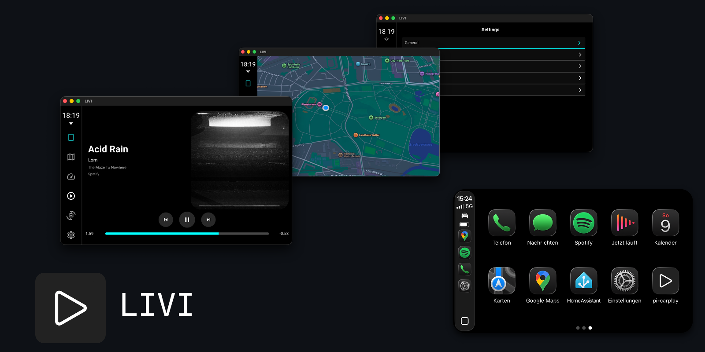
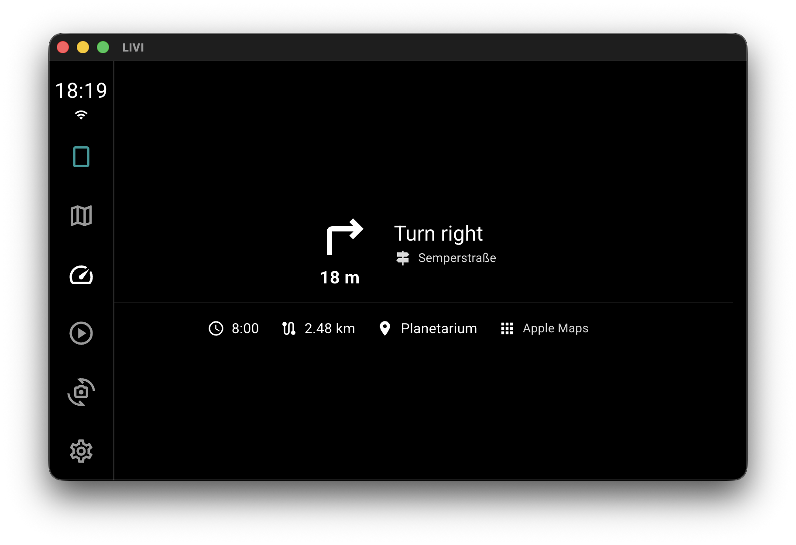
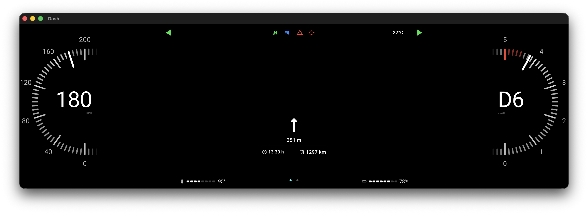
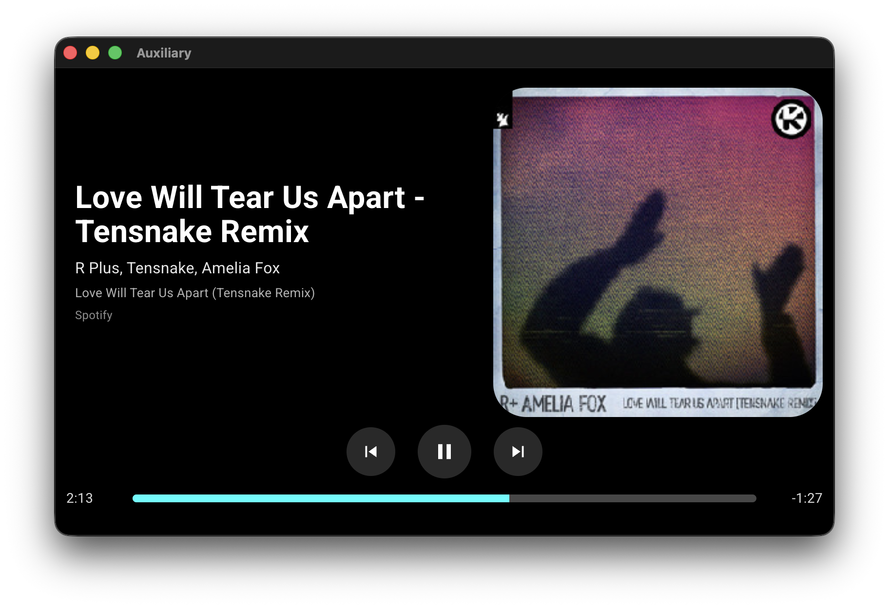
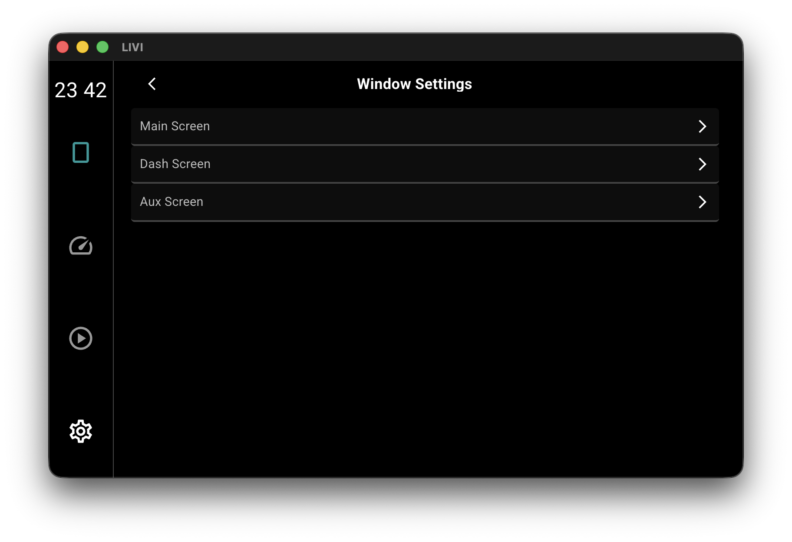
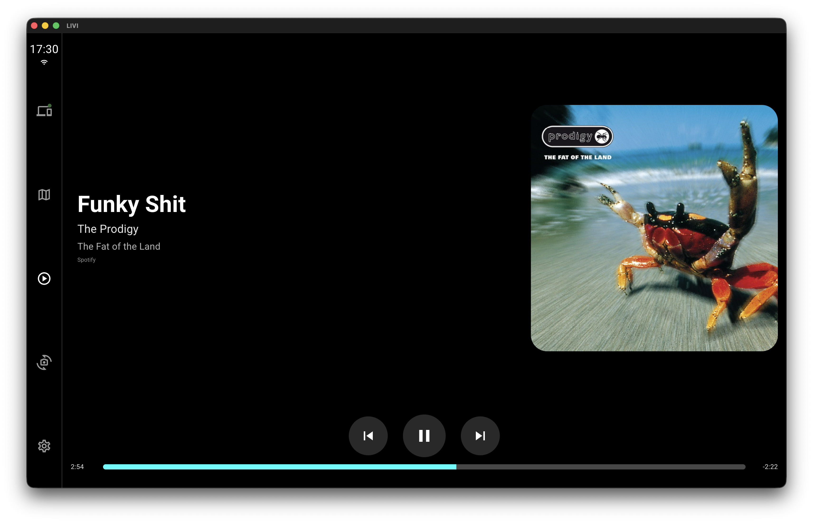
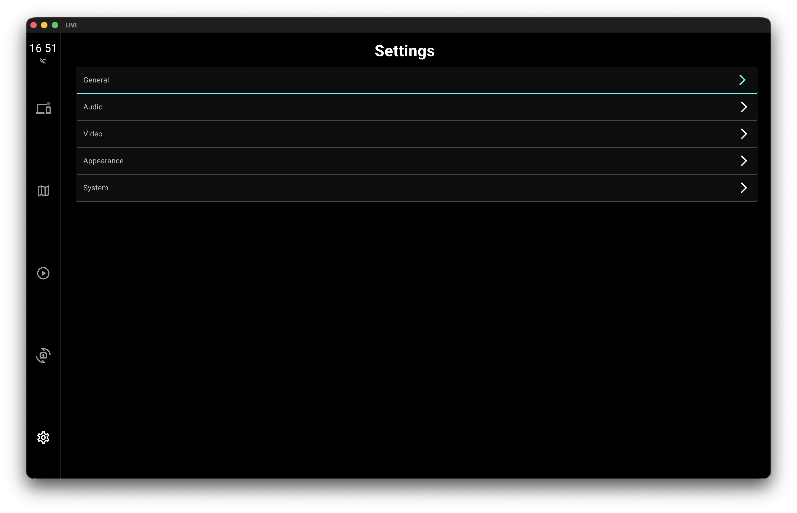

<p align="center">
  
</p>

# LIVI – Linux In-Vehicle Infotainment

LIVI is an open-source **Apple CarPlay and Android Auto head unit**.

It is a standalone cross-platform head unit with a native, zero-copy GStreamer video pipeline and hardware-accelerated decoding on Linux (including the Raspberry Pi 4 and 5) and macOS, low-latency audio, multitouch + D-Pad navigation, and support for very small embedded/OEM displays.


## Project Status


## Native Connectivity

- **Apple CarPlay** (wired & wireless) on Linux — requires [MFi Authentication](#mfi-authentication)
- **Android Auto** (wired) on all platforms
- **Android Auto** (wireless) on Linux

## Native Apple CarPlay

LIVI implements the CarPlay accessory side natively on Linux. Wireless sessions run over LIVI's own Wi-Fi access point with Bluetooth pairing, wired sessions run directly over the USB cable (no OTG required).

- main + instrument cluster video (H.264/H.265, hardware decoded, zero-copy)
- audio playback, phone calls, microphone uplink
- now-playing metadata incl. album art, turn-by-turn navigation data
- touch, knob/D-Pad and hard-key input
- day/night mode and GPS forwarding to the phone
- multi-session with live switching between connected phones

Wireless CarPlay requires a Bluetooth adapter and a Wi-Fi interface dedicated to the access point. Wired CarPlay works on any USB port.


## MFi Authentication

CarPlay requires the accessory to authenticate against the phone using an Apple **MFi authentication coprocessor**. This is a hardware chip, it cannot be emulated in software, and LIVI does not ship or bypass it. You need a physical coprocessor (e.g. salvaged from a certified CarPlay accessory or sourced as a module) wired to the I²C bus of your board.

LIVI talks to the chip directly. Configuration (`config.json`):

| Key                   | Default | Description                          |
| --------------------- | ------- | ------------------------------------ |
| `carPlayMfiI2cBus`    | `2`     | I²C bus number the coprocessor is on |
| `carPlayMfiPowerGpio` | `21`    | GPIO that powers the coprocessor     |

Without a coprocessor, native CarPlay is unavailable. Dongle-based CarPlay and all Android Auto paths work regardless.


## Wireless

Wireless sessions do not need a router. LIVI brings up its own Wi-Fi access point and the phone joins that. Bluetooth carries the pairing and the handover, the session itself then runs over Wi-Fi.

Wireless CarPlay and wireless Android Auto are enabled separately, so a head unit can offer one, both, or neither. With Auto Connect on, a phone that has been paired before is picked up again on its own. The car name is what the phone shows when it lists nearby vehicles.

The Wi-Fi page sets the band, password, channel and country for the access point, and picks which Wi-Fi and Bluetooth adapter to use.

Dedicated Interface reserves the Wi-Fi adapter for the access point and brings it up during boot, out of NetworkManager's hands. Without it the access point is started on demand and the interface is handed back afterwards, which keeps it available for normal networking but costs a moment on the first connection.

Configure under Settings → General → Connections.

<p align="center">
  
  &emsp;
  
</p>


## Multi-Session

Several phones can be connected at the same time. All of them are tracked live: every session keeps its state, its battery and signal readings, its media metadata and its turn-by-turn navigation up to date in the background, not just the one on screen.

Switching is a handover, not a reconnect. The drivers stay armed and the video and audio paths stay open, so bringing another phone forward takes milliseconds instead of multiple seconds.

Wireless CarPlay, wired CarPlay and wireless Android Auto each take several devices at once. Wired Android Auto is currently limited to one device. Everything within that limit can be combined freely, so a mixed set of CarPlay and Android Auto phones over cable and Wi-Fi is a normal case, not an exception.

Each device is shown with its transport, its battery level and its carrier or signal strength, and the numbered badge is the slot it occupies. The active session is highlighted, the others are marked as available.

Switch from the device list, or bind a key under Settings → General → Key Bindings → Cycle Session to step through the connected phones. Removing a device ends its session and forgets the pairing.

Manage under Settings → Devices.

<p align="center">
  
</p>


## Display Calibration

Car displays are rarely colour accurate. Cheap panels wash out blacks, run cold or warm, or crush the shadows once the sun hits them. LIVI can correct this in software.

Gamma, contrast, and the red, green and blue channels are adjustable independently. The correction is applied by the compositor as a single pass over the finished frame, so it covers everything on screen: the LIVI interface, the dashboards, and the projected CarPlay or Android Auto video alike.

The pass only runs while a value differs from its default, so a display that needs no correction costs nothing.

Configure under Settings → Appearance → Contrast / Gamma and Settings → Appearance → Color.

<p align="center">
  
  &emsp;
  
</p>


## Dashboard

The Dashboard is a WIP. While the IPC/socket telemetry payload already supports many signals, the UI exposes only a subset. Widgets and layouts will be extended over time.

### Telemetry CLI (local)

To push test data into a running LIVI, use the CLI in `scripts/tools`. The full
field list and routing lives in
`src/main/shared/types/Telemetry.ts`.

```bash
pnpm -C scripts/tools install

# Realistic all-fields demo push
pnpm -C scripts/tools run telemetry:demo

# Send single fields or blocks ad-hoc
pnpm -C scripts/tools run telemetry:set fuelPct=4 rangeKm=38
pnpm -C scripts/tools run telemetry:set gps.lat=53.5912 gps.lng=10.015
pnpm -C scripts/tools run telemetry:set _repeatMs=1000 speedKph=90 rpm=2500
```

<p align="center">
  
</p>


## GPS

LIVI reads a GNSS receiver on a serial port. The fix is published into the telemetry
store, from where the existing adapters carry it to CarPlay and Android Auto.

Any receiver speaking **NMEA-0183** works. On **u-blox** modules LIVI additionally polls
UBX for the module identity and the RF front end. Development and testing were done with
a **NEO-M9N**. Configuration (`config.json`):

| Key           | Default        | Description                                |
| ------------- | -------------- | ------------------------------------------ |
| `gpsEnabled`  | `false`        | Read the receiver                          |
| `gpsDevice`   | `/dev/ttyAMA0` | Serial device                              |
| `gpsBaudRate` | `38400`        | NEO-M9N default; older modules use `9600`  |
| `timezone`    | `""`           | Last zone derived from a fix, applied at start |

The receiver also serves as a **time source**. Its satellite clock sets the system time, ahead of the time a phone offers at CarPlay session start, and the fix position selects the system timezone, so daylight saving follows the tz database instead of a manual switch.

Settings → General → GPS shows the live values under **GPS Data**, and the module identity together with antenna and interference state under **HW Info**. The same data is
mirrored to `gpsData.json` for external tools.

On a Raspberry Pi 5, `/dev/ttyAMA0` on GPIO 14/15 (PIN 8/10) does not exist until `dtoverlay=uart0` is set in `config.txt`.

<p align="center">
  
  &emsp;
  
</p>


## Multi-Display

LIVI can run as multiple windows at once, each placeable on its own physical display.
The Dash and Aux windows are freely assignable and can show the Dashes, the reverse camera or the media player. Assignment is not exclusive: any feature can be shown on one, several, or all windows at the same time.

Configure each window under Settings → Window Settings
(Main Screen / Dash Screen / Aux Screen), and assign features under
Settings → General → Tab Settings.

<p align="center">
  
</p>

<p align="center">
  
  
</p>


## View and Safe Area

Stream resolution, view area insets, and safe area can be configured independently for the main and cluster streams. This is supported for Android Auto as well as CarPlay.

### Main Stream
Video: 1280x720 - View Area: 0/0/100/0 (T/B/L/R) - Safe Area: 100/100/100/100 (T/B/L/R) - Draw Outside: true
<p align="center">
  
</p>

### Cluster Stream
Video: 1920x1080 - View Area: 0/0/0/0 (T/B/L/R) - Safe Area: 120/20/500/500 (T/B/L/R)
<p align="center">
  
</p>


## Images

<p align="center">
  
  &emsp;
  
</p>

<p align="center">
  
  &emsp;
  
</p>


## Installation

> [!IMPORTANT]
> LIVI requires **OpenGL ES 3.x**.

One script installs LIVI on both desktop and headless hosts, auto-detecting which (override with `--desktop` / `--headless`). It uses apt or dnf, so beyond Raspberry Pi OS it also runs on Debian/Ubuntu, Fedora and likely other distros, on arm64 and x86_64.

```bash
curl -fL -o install.sh https://raw.githubusercontent.com/f-io/LIVI/main/scripts/install/install.sh
chmod +x install.sh
./install.sh
```

_Tested on Raspberry Pi OS, Ubuntu 26.04 and Fedora 44._

> [!NOTE]
> The Pi 4, CM 4, Pi 5 and CM 5 require Trixie (Debian 13) for OpenGL ES 3.x. Pi 3 and earlier use the VideoCore IV GPU (OpenGL ES 2.0 only) and are unsupported.

> [!NOTE]
> The headless flow sets the boot target to `multi-user.target`, disabling a graphical login. Undo with `sudo systemctl set-default graphical.target`.


## Linux (x86_64)

This AppImage has been tested on Debian Trixie (13) with Wayland, Fedora 44 (GNOME) and Ubuntu 26.04.

```bash
chmod +x LIVI-*-x86_64.AppImage
```

> **Hardware video decode (optional):** LIVI uses the system VA-API driver for GPU video decode (it is not bundled, since it must match your GPU and kernel). Most desktops ship it, a minimal install may not. Without it LIVI still works via software decode. For HW decode install the driver for your GPU and verify with `vainfo`: `i965-va-driver` (older Intel, e.g. Broadwell), `intel-media-va-driver` (Gen9+ Intel), `mesa-va-drivers` (AMD).


## Mac (arm64)

Download the `-arm64.dmg`, open it, and drag **LIVI.app** into Applications.

When launching the app for the first time, macOS may block it.
In that case:

1. Try to open the app once (it will be blocked)
2. Go to **System Settings → Privacy & Security**
3. Scroll down and click **“Open Anyway”**
4. Confirm the dialog

After this, the app will launch normally and future updates will work without additional steps.


## Build Environment


### System Requirements (build)

Make sure the following packages and tools are installed on your system before building. The lists below cover both building and running, including everything native CarPlay needs:

- **Node.js 24.x** (with `corepack` for `pnpm`)
- **Rust** (stable, ≥ 1.88 — via [rustup](https://rustup.rs)): builds everything native — `livi-helperd`, `livi-compositor`, and the addons `livi-crypto`, `livi-gst-video` and `livi-gst-host`.
- **build-essential** (Linux: includes `gcc`, `g++`, `make`, etc.)
- **libgstreamer1.0-dev** + **libgstreamer-plugins-base1.0-dev** (required to build the `livi-gst-video` addon and the `livi-gst-host` binary)
- **pkg-config**, **cmake** (AWS-LC build), **libwayland-dev** + **libxkbcommon-dev** (Linux only: the embedded Wayland compositor links both)
- runtime packages for native CarPlay and wireless Android Auto: **bluez**, **libspa-0.2-bluetooth**, **hostapd**, **dnsmasq-base**, **iw**, **rfkill**, **avahi-daemon**, **avahi-utils**, **pulseaudio-utils**

On Debian/Ubuntu/Raspberry Pi OS, install everything with:

```bash
sudo apt-get update
sudo apt-get install -y git build-essential \
  pkg-config cmake \
  libgstreamer1.0-dev libgstreamer-plugins-base1.0-dev \
  libwayland-dev libxkbcommon-dev \
  fuse3 bluez libspa-0.2-bluetooth hostapd dnsmasq-base iw rfkill avahi-daemon avahi-utils \
  pulseaudio-utils
curl -fsSL https://deb.nodesource.com/setup_24.x | sudo -E bash -
sudo apt-get install -y nodejs
sudo corepack enable
curl --proto '=https' --tlsv1.2 -sSf https://sh.rustup.rs | sh -s -- -y
```

The helper talks to the MFi coprocessor and the GPIO that powers it through the kernel's
i2c and gpio character devices, so no extra package is needed for either.

On Fedora, install everything with:

```bash
sudo dnf install -y git gcc gcc-c++ make \
  pkgconf-pkg-config systemd-devel cmake \
  gstreamer1-devel gstreamer1-plugins-base-devel \
  wayland-devel libxkbcommon-devel \
  fuse3 fuse3-libs \
  bluez hostapd dnsmasq iw avahi avahi-tools pulseaudio-utils
curl -fsSL https://rpm.nodesource.com/setup_24.x | sudo bash -
sudo dnf install -y nodejs
sudo corepack enable
curl --proto '=https' --tlsv1.2 -sSf https://sh.rustup.rs | sh -s -- -y
```

Fedora has no `rfkill` package, the command comes with `util-linux`. `libspa-0.2-bluetooth` is a Debian name too: it holds PipeWire's Bluetooth plugin, which Fedora ships inside `pipewire-libs`. Wireless Android Auto needs that plugin because the phone will only start a session over an HFP connection, and PipeWire is what puts HFP into the adapter's service record. LIVI's package check probes for the plugin's directory rather than a package name, so it reports the gap on any distro. Everything else, including wireless CarPlay, works the same.

On macOS, the `livi-gst-video` addon links against the **GStreamer.framework**. Install
both the runtime and development packages (matching versions) from
[gstreamer.freedesktop.org](https://gstreamer.freedesktop.org/download/#macos)
before building. The cargo build discovers it via `pkg-config` under
`/Library/Frameworks/GStreamer.framework`; besides that, macOS needs only
Node.js, pnpm and Rust.

### Clone & Build

```bash
# Git clone
git clone --branch main --single-branch https://github.com/f-io/LIVI.git \
  && cd LIVI

# Install dependencies from lockfile
pnpm run install:ci

# --- Build targets ---

# Linux (AppImage)
pnpm run build:linux:arm64         # ARM
pnpm run build:linux:x64           # X86_64

# macOS (dmg)
pnpm run build:mac:arm64           # Apple Silicon
pnpm run build:mac:x64             # Intel
```


## Debugging

Diagnostic environment flags and where to find the logs are documented in [DEBUGGING.md](DEBUGGING.md).


## Credits

See [CREDITS](CREDITS.md) for acknowledgements and prior art.


## Disclaimer

_Apple and CarPlay are trademarks of Apple Inc. Android and Android Auto are trademarks of Google LLC. This project is not affiliated with or endorsed by Apple or Google. All product names, logos, and brands are the property of their respective owners._


## License

LIVI is free software, licensed under the **GNU General Public License v3.0 or later** (`GPL-3.0-or-later`). See [LICENSE](LICENSE) for the full text.

Copyright (C) 2025 Lasse Heitgres

You are free to use, study, share, and modify LIVI. If you distribute it or a modified version, you must pass on the same freedoms and make the corresponding source available under the GPL. It comes with NO WARRANTY, to the extent permitted by law.
